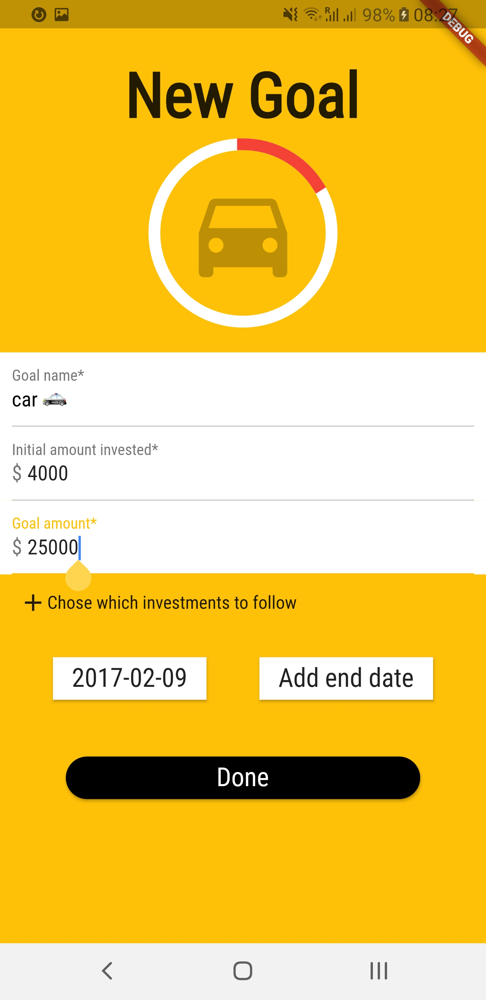
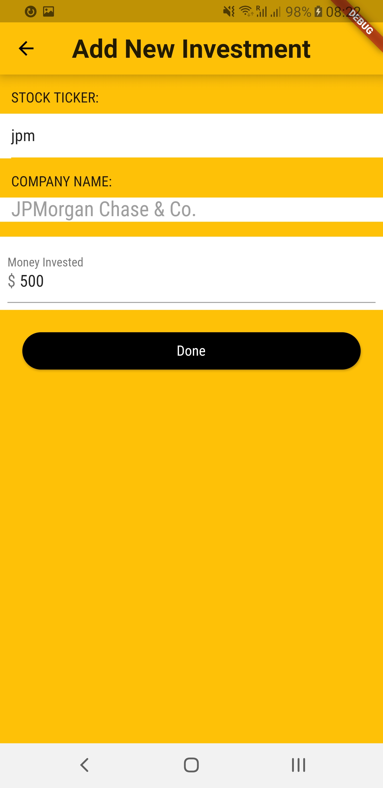
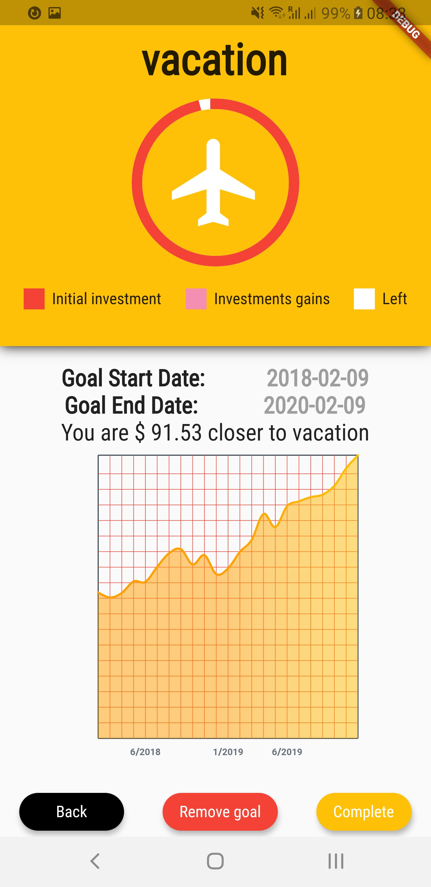
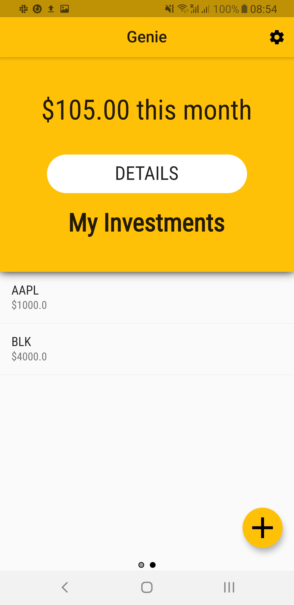
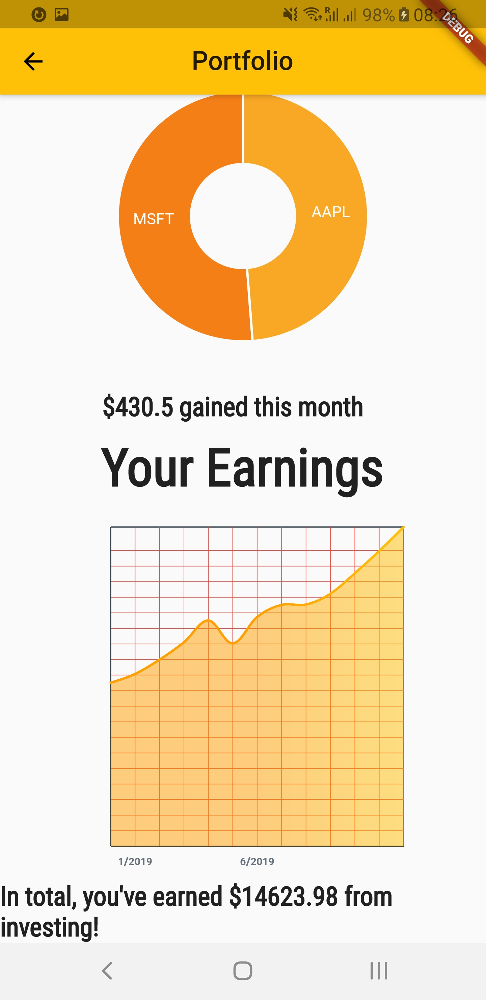
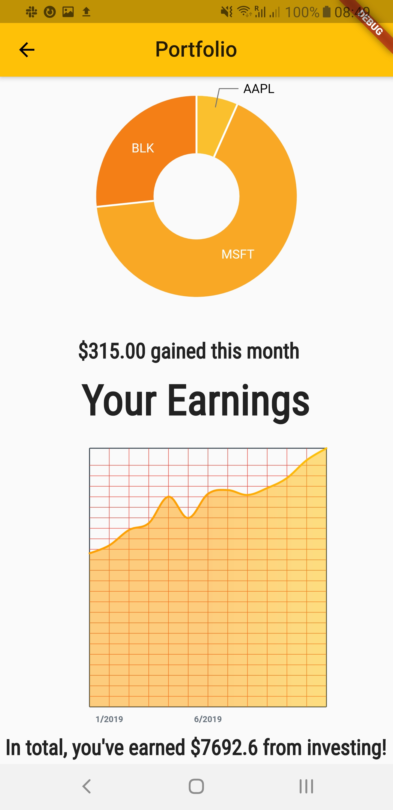
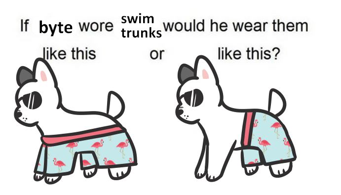

# Genie

## Huzzah we won the [Blackrock Challenge!!](https://devpost.com/software/genie-isj1tw)
###### App preview at the bottom 

## Inspiration
Investing can feel like a daunting and faraway task, especially for us college students. Between exams, extracurriculars, and internship hunting, trying to understand investing and its potential benefits can be both time extensive and overwhelming. Genie breaks these barriers by cataloging your financial goals and showing how investment can be approachable and beneficial. With a simple but powerful UI, Genie breaks investment down to the basics while also providing users the chance to learn more through the app.

## What it does
Genie allows users to set short and long term goals, ranging anywhere from a night out with friends to the down payment on your first apartment. Then, the application connects this goal with investment and tracks how the gains from these investments have contributed towards your goal. By showing the connection between accomplishment and investment, we encourage students to enter the world of investing as well as prompting them to plan for their future.

## How I built it
The initial mockups were done in Figma in order to create the best layout and user interface would lead to an intuitive and fulfilling experience. Flutter and Dart were used to create Genie, while Firebase and MobX were used for data storage and information management. We also used data from the BlackRock API to support our findings.

## Challenges I ran into
For some group members, this was their first time using Flutter, so figuring out how Dart and Flutter work proved to be a challenge. It was also difficult to balance simplicity and information in a mobile app, and we had to make tough decisions about what information to keep. The BlackRock API was also difficult to navigate at times.

## Accomplishments that I'm proud of
Understanding a new language is always a worthwhile endeavor, and this final product is the most polished end result that any of member has made at a hackathon. 

## What I learned
We learned about the value of design, which was something BlackRock had emphasized when explaining the challenge. We also understand more about Fluttter and its use cases now, which is a valuable asset as Flutter continues to expand and grow.

## What's next for Genie
In the future, we'd like the expand the audience of Genie. People of all ages can find investment a difficult topic to breach, so we want to create a quiz that could develop a profile for a user and recommend stocks to purchase based on their risk tolerance and profit turnover.

## How Can I run this
If you want to run this repo on your machine you have to replace the GoogleService-Info.plist with your own. The one in this repo is no longer valid. Or you can just skip the authentication by editing the main and replacing RootPage with HomePage.

## Creating a new goal

## Adding new investments to track

## Goal Progress Report

## Investments preview

## Detailed investments

## See how your portfolio grows and diversifies!

## Bonus pic from our wonderous designer :)

